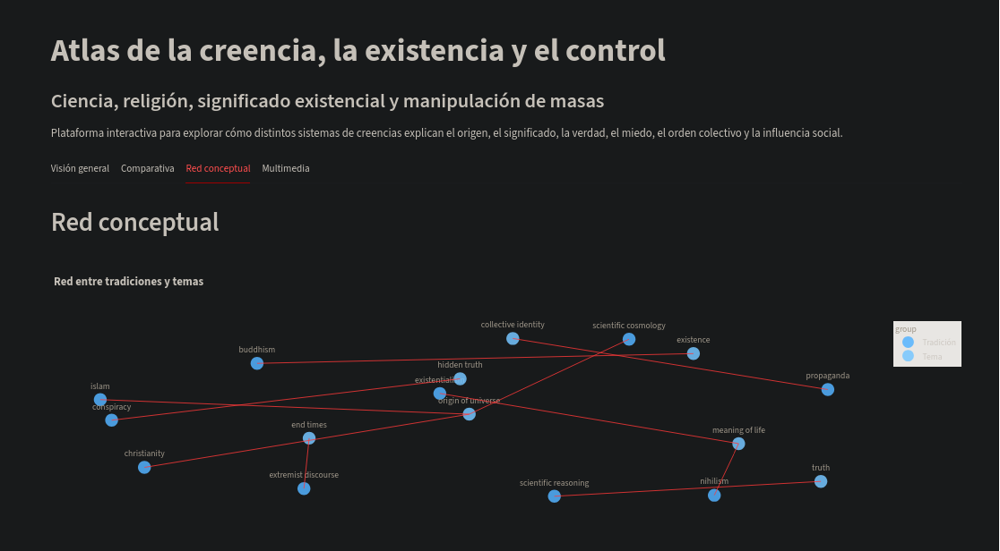
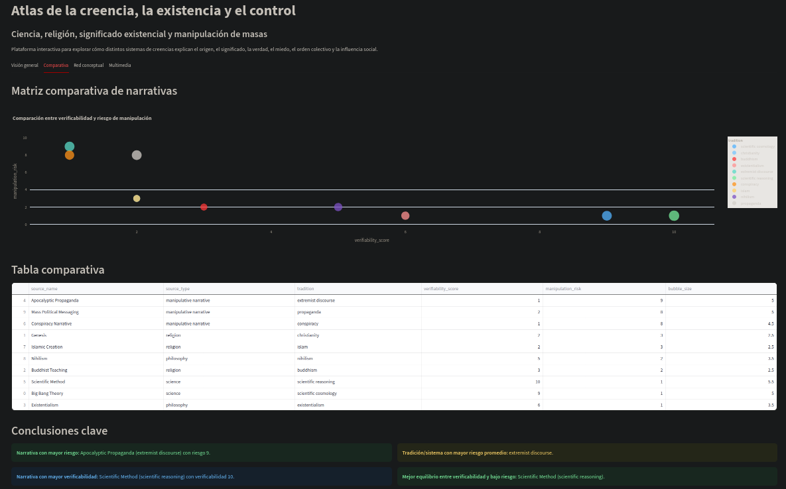
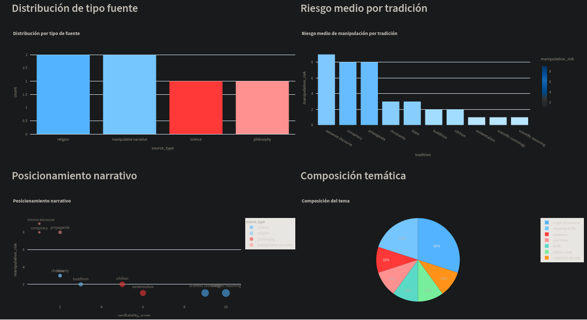
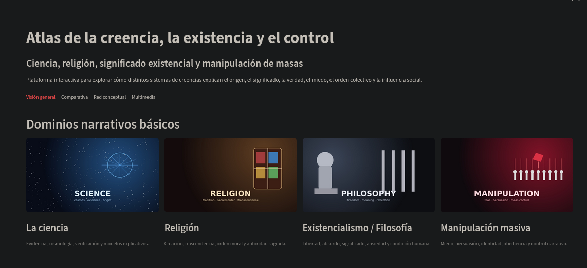

# Atlas of Belief, Existence and Control

<p align="center">
  
</p>

<p align="center">
  <b>Interactive Streamlit dashboard for analyzing belief systems, narratives and mass influence.</b>
</p>

<p align="center">
  
  
  
  
</p>

---

## Overview

This project explores how different narrative systems shape perception of reality, meaning, truth and social control.

It focuses on four core domains:

- Science  
- Religion  
- Existentialism / Philosophy  
- Mass Manipulation  

Using a structured dataset, the system allows deep comparative analysis between narratives.

---

## Key Insights

- Not all narratives aim for truth — many optimize influence  
- Scientific narratives prioritize verifiability  
- Religious systems prioritize meaning and structure  
- Manipulative narratives maximize emotional impact and control  
- Philosophical systems explore existence without fixed answers  

---

## Dashboard Preview

### Overview


### Analytical Comparison


### Conceptual Network


### Multimedia Section


---

## Features

- Narrative filtering by source and tradition/system  
- Interactive dataset exploration  
- Visual thematic categorization  
- Comparative analysis of narratives  
- Manipulation risk scoring  
- Conceptual network visualization  
- Multimedia integration  
- Automated analytical conclusions  

---

## Technologies

- Python  
- Streamlit  
- Pandas  
- Plotly  
- NetworkX  

---

## Project Structure

```
atlas-belief-existence-control/
│
├── app/
│   └── dashboard.py
│
├── data/
│   └── raw/
│       └── narrative_dataset.csv
│
├── images/
│   ├── science.jpg
│   ├── religion.jpg
│   ├── philosophy.jpg
│   └── manipulation.jpg
│
├── videos/
│   ├── cosmos.mp4
│   ├── religion.mp4
│   ├── philosophy.mp4
│   └── manipulation.mp4
│
├── assets/
│   └── screenshots/
│       ├── overview.png
│       ├── comparison.png
│       ├── network.png
│       └── multimedia.png
│
├── README.md
└── requirements.txt
```

---

## How to Run

```bash
pip install -r requirements.txt
streamlit run app/dashboard.py
```

---

## Purpose

To build a unified analytical framework that explains how belief systems operate, influence societies and shape human perception.

---

## Author

Sebastian Valles

---

## License

This project is for educational and analytical purposes.